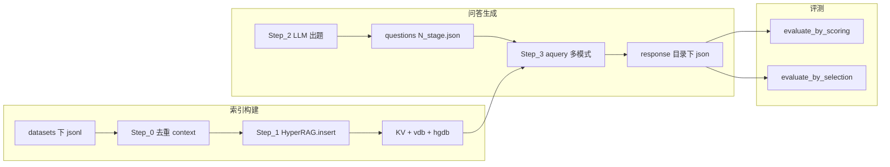
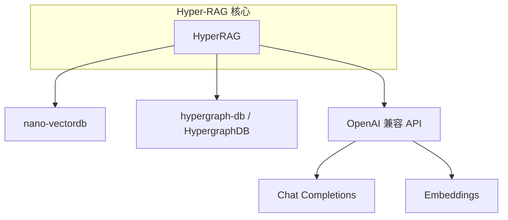

# Hyper-RAG 架构说明

本文档描述本仓库的模块划分、数据流、`HyperRAG` 工作目录下的持久化布局，以及 README 与代码实现不一致之处，便于复现与二次开发。

## 1. 仓库目录与职责

以下路径相对于仓库根目录；`web-ui/`、`datasets/` 仅标职责，不展开业务细节。

| 路径 | 作用 |
|------|------|
| `hyperrag/` | 核心库：`HyperRAG`、`QueryParam`、入库（`insert`）、多模式查询（`query` / `aquery` / `astream_query`）、KV/向量/超图存储抽象 |
| `reproduce/` | 论文级流水线：`Step_0`～`Step_3`（去重 context、建索引、出题、多模式答题） |
| `evaluate/` | 打分评测（`evaluate_by_scoring`）与双答案对比评测（`evaluate_by_selection`） |
| `examples/` | 最小演示：`hyperrag_demo.py` 与 `mock_data.txt` |
| `service_api.py` | FastAPI 服务：读取已构建的 `caches/<data_name>`，支持流式与非流式查询 |
| `config_temp.py` | 复制为根目录 `my_config.py` 的模板（LLM 与 Embedding 的 URL、密钥、模型名、`EMB_DIM` 等） |

## 2. 核心类与持久化存储

### 2.1 `HyperRAG`（`hyperrag/hyperrag.py`）

在 `working_dir` 下挂载多类存储，由 `hyperrag/storage.py` 等实现：

| 类型 | 说明 | 典型文件 |
|------|------|----------|
| KV（JSON） | 全文、分块、可选 LLM 响应缓存 | `kv_store_full_docs.json`、`kv_store_text_chunks.json`、`kv_store_llm_response_cache.json` |
| 向量库 | `NanoVectorDB`，按 namespace 持久化 | `vdb_entities.json`、`vdb_relationships.json`、`vdb_chunks.json` |
| 超图 | `HypergraphStorage`，基于 `hypergraph-db` 的 `HypergraphDB` | `hypergraph_chunk_entity_relation.hgdb` |
| 日志 | 运行日志 | `HyperRAG.log` |

分块、实体/关系抽取、各类检索与提示组装的主要逻辑在 `hyperrag/operate.py`（体量较大）。

### 2.2 配置要点

- 根目录需存在 **`my_config.py`**（由 `config_temp.py` 复制并填写），`reproduce/`、`evaluate/`、`examples/`、`service_api.py` 均依赖其中的 `LLM_*`、`EMB_*`。
- **`EmbeddingFunc(embedding_dim=EMB_DIM)`** 必须与所用嵌入模型的**实际向量维度**一致；更换嵌入模型时务必同步修改 `EMB_DIM`，否则向量库维度错乱。

## 3. 查询模式 `QueryParam.mode`

定义见 `hyperrag/base.py` 中 `QueryParam`；`hyperrag/hyperrag.py` 的 `aquery` / `astream_query` 根据 `mode` 分发。

| `mode` | 含义（概要） |
|--------|----------------|
| `hyper` | 完整超图增强检索与生成 |
| `hyper-lite` | 轻量超图检索变体（速度与成本权衡） |
| `graph` | 图式检索路径 |
| `naive` | 朴素向量块检索 |
| `llm` | 主要依赖 LLM、弱检索或无典型 RAG 检索的路径（以 `operate.py` 实现为准） |

`astream_query` 仅支持部分 `mode`（如 `hyper`、`hyper-lite`、`naive`、`llm`），且依赖配置 `llm_model_stream_func`；详见 `hyperrag/hyperrag.py`。

## 4. 端到端数据流（复现主路径）



- **Step_0**（`reproduce/Step_0.py`）：从 `datasets/<data_name>/*.jsonl` 读取每行的 `context` 字段，按文件去重后写入 `caches/<data_name>/contexts/<jsonl 文件名不含扩展名>_unique_contexts.json`。默认 `data_name` 由 `reproduce/pipeline_defaults.py` 中的 `DATA_NAME` 给出（当前为 **`neurology`**）；可用 `--data-name` 或 `-i` / `-o` 覆盖输入、输出目录。
- **Step_1**（`reproduce/Step_1.py`）：读取 `caches/{data_name}/contexts/{data_name}_unique_contexts.json`，调用 `rag.insert(...)`；`working_dir` 为 `caches/<data_name>`。**须保证** 主 jsonl 的文件名 stem 与 `data_name` 一致（例如 `datasets/neurology/neurology.jsonl` → `neurology_unique_contexts.json` 与 `data_name=neurology`）。多 jsonl 时每个 stem 各生成一个文件，Step_1 仍只读 `{data_name}_unique_contexts.json`，请保持单一主文件或自行改 Step_1 路径。
- **Step_2**（`reproduce/Step_2_extract_question.py`）：用 LLM 生成问题列表，输出到 `caches/<data_name>/questions/`（如 `1_stage.json` 等），`question_stage` 在脚本内配置。
- **Step_3**（`reproduce/Step_3_response_question.py`）：对问题列表调用 `aquery`，通过 `mode` 切换 **naive / hyper / hyper-lite** 等，结果写入 `caches/<data_name>/response/`。
- **评测**：`evaluate/evaluate_by_scoring.py` 需要问题文件、对应的 `*_ref` 参考文件及 Step_3 答案 json；`evaluate/evaluate_by_selection.py` 需要两套方法的答案文件。评测输出目录在代码中写为 **`caches/<data_name>/evalation/`**（拼写为 `evalation`，非 `evaluation`）。

## 5. `caches/<data_name>` 目录结构（约定）

在典型复现流程下，与 `HyperRAG.working_dir = caches/<data_name>` 对齐时，常见布局如下：

```
caches/<data_name>/
  contexts/              # Step_0 输出
    <stem>_unique_contexts.json
  questions/             # Step_2
    1_stage.json
    ...
  response/              # Step_3
    ...
  evalation/             # evaluate 脚本输出（目录名以代码为准）
  kv_store_*.json
  vdb_*.json
  hypergraph_chunk_entity_relation.hgdb
  HyperRAG.log
```

示例演示 `examples/hyperrag_demo.py` 使用 `caches/mock` 作为 `working_dir`。

## 6. Neurology 主链路（Step_0～3）与 API 配置

### 6.1 数据名与路径

| 项 | 值 |
|----|-----|
| 默认 `data_name` | `neurology`（定义在 `reproduce/pipeline_defaults.py` 的 `DATA_NAME`） |
| 原始数据 | `datasets/neurology/neurology.jsonl`（每行含 `context` 字段） |
| Step_0 输出 | `caches/neurology/contexts/neurology_unique_contexts.json` |
| Step_1 `working_dir` | `caches/neurology` |
| Step_2 输出 | `caches/neurology/questions/<n>_stage.json` 与同名 `_ref.json` |
| Step_3 输出 | `caches/neurology/response/<mode>_<n>_stage_result.json` |

各脚本均支持命令行 `--data-name <name>`，与修改 `pipeline_defaults.DATA_NAME` 等价（优先用命令行做一次性实验）。

**推荐执行顺序（在仓库根目录、已配置 `my_config.py`）：**

```bash
python reproduce/Step_0.py
python reproduce/Step_1.py
python reproduce/Step_2_extract_question.py
python reproduce/Step_3_response_question.py
```

### 6.2 Chat / Embedding（含 vLLM）与 `my_config.py`

根目录 **`my_config.py`**（由 `config_temp.py` 复制）为单一配置源：

| 变量 | 作用 |
|------|------|
| `LLM_BASE_URL` | OpenAI 兼容 API 根地址；自建 **vLLM** 时一般为 `http://<主机>:<端口>/v1` |
| `LLM_API_KEY` | 网关要求的密钥（无密钥时可填占位，依服务端而定） |
| `LLM_MODEL` | 与部署一致的 chat 模型名；**Step_1、Step_2、Step_3** 的 chat 均使用此处（Step_2 已从硬编码 `gpt-4o` 改为读取 `LLM_MODEL`，便于与 vLLM 对齐） |
| `EMB_BASE_URL` / `EMB_API_KEY` / `EMB_MODEL` | 向量嵌入端点 |
| `EMB_DIM` | 必须与嵌入向量真实维度一致 |

不要将真实密钥写入 `arch.md` 或提交到版本库；仅在本地维护 `my_config.py`。

## 7. 与 README 的差异与文档级说明

| 主题 | README 描述 | 代码/本仓库实际 |
|------|----------------|-----------------|
| 缓存目录名 | Quick Start 写 `cache/{{data_name}}/questions`、`cache/{{data_name}}/response` | `reproduce/`、`examples/`、`service_api.py` 统一使用 **`caches/`**（复现以代码为准） |
| Web-UI | 指向 `./web-ui/README.md`、Docker 说明 | 若本地无 `web-ui` 或上游结构变更，需以仓库实际内容为准；**论文数值复现不依赖** Web-UI |
| 依赖 | 仅 `pip install -r requirements.txt` | 跑 Step_2/3、`service_api`、评测时需额外包，见 **`requirements.txt`**（已补 `tqdm`、`fastapi`、`uvicorn` 等） |
| `QueryParam` 默认 `mode` | 未强调 | 默认 `"hyper-query"` 与 `aquery` 分支不兼容，须显式指定 `mode` |
| 评测输出目录 | README 未写 | 代码使用目录名 **`evalation`**（拼写错误但路径固定） |

## 8. 外部依赖关系（概要）



- **LLM / Embedding**：通过 `openai` 兼容客户端访问（含 vLLM 等自建服务的 `base_url`）。
- **向量检索**：`nano-vectordb`。
- **超图**：`hypergraph-db`（PyPI 包名 `hypergraph-db`，代码中 `from hyperdb import HypergraphDB`）。

---

更细的 prompt 与字段定义见 `hyperrag/prompt.py`；HTTP 服务环境变量见 `service_api.py` 顶部 `HYPERRAG_*`。
