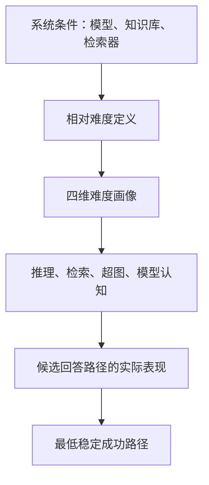

# 面向超图自适应 RAG 的问题集构造说明

## 一、研究背景与总体目标

本研究面向“超图 RAG + 自适应 RAG”的组合场景，当前首先在医学数据集上验证，后续扩展到其他领域。

问题集不应只用于测量“最终答案是否正确”，还需要支持以下研究目标：

1. 区分问题究竟难在哪里；
2. 判断一个问题是否需要检索；
3. 判断普通检索是否足够，还是需要超图检索与多步推理；
4. 为每个问题确定能够稳定正确作答的最低成本路径；
5. 评价路由器是否在正确性、检索成本和推理成本之间作出了合理选择。

因此，本问题集中的“难度”不应被看作问题文本固有的单一属性，而应被描述为：

$$
D(q\mid \mathcal S)
$$

其中 \(q\) 是问题，\(\mathcal S\) 是当前系统环境，包括基础模型、知识库、检索器、超图结构和可用推理路径。

换句话说，同一个问题对于不同模型和不同知识库，可能具有完全不同的难度。

## 二、基于模型能力的相对问题难度

### 2.1 核心定义

问题难度不是绝对的，而是相对于特定模型及其可用资源定义的。

可以将系统环境表示为：

$$
\mathcal S=(M,K,R,\Pi)
$$

其中：

- \(M\)：基础语言模型；
- \(K\)：当前领域知识库或超图；
- \(R\)：检索系统；
- \(\Pi\)：系统允许选择的回答路径集合。

一个医学问题对通用模型可能很难，但对医学领域模型可能很容易；对没有最新知识的模型很难，但对连接了医学知识库的系统可能很容易。因此，问题不应永久地被标记为“简单”或“困难”，而应具有一个与系统条件绑定的相对难度描述。

### 2.2 背景意义

传统数据集通常把难度视为问题本身的属性，例如按照题目长度、推理步数或者人工主观判断划分简单、中等和困难。

这种划分在自适应 RAG 中存在局限：

- 问题文本复杂，不代表模型一定不会；
- 问题文本简单，也可能包含模型未知的专业事实；
- 标注为多跳的问题，可能因为知识冗余而存在单跳捷径；
- 更换基础模型、知识库或检索器后，原有难度标签可能失效。

研究已经发现，形式上的组合问题并不一定真正要求多跳推理，因为模型可能通过数据中的冗余信息或捷径直接得到答案。因此，“设计上包含几跳”不能直接等同于“实际难度有多高”。[Compositional Questions Do Not Necessitate Multi-hop Reasoning](https://aclanthology.org/P19-1416/)

### 2.3 执行动机

采用相对难度定义，主要是为了让问题集能够适应模型和系统能力的变化。

它可以回答三个不同的问题：

- 这个问题在语言和知识结构上是否复杂？
- 当前模型能否仅依赖参数知识回答？
- 当前系统最低需要提供多少外部能力才能稳定回答？

这对医学场景尤其重要，因为医学问题可能同时受到专业知识覆盖、术语表达、证据时效性和临床推理复杂度的影响。只根据问题文本判断难度，很难区分“推理困难”和“模型没见过相关知识”。

### 2.4 理论依据

项目反应理论（Item Response Theory，IRT）提供了直接的理论基础。IRT 不把一道题的难度孤立地看待，而是通过“被试能力”和“题目属性”的交互关系解释正确概率。将被试替换成语言模型，就可以把问题难度理解为相对于模型能力的潜在属性。[Item Response Theory for Natural Language Processing](https://aclanthology.org/2024.eacl-tutorials.2.pdf)

其基本思想可以概括为：

$$
P(\text{correct}\mid q,M)=f(\theta_M,b_q)
$$

其中：

- \(\theta_M\) 表示模型能力；
- \(b_q\) 表示问题对当前能力尺度的要求；
- 正确概率取决于两者的相对关系。

在本研究中，还需要把检索器、知识库和推理路径纳入条件，因此难度不只是“问题相对于模型”，而是“问题相对于整个 RAG 系统”。

### 2.5 期望结果

采用相对难度后，问题集应产生以下性质：

- 一个问题可以随着模型或知识库变化而重新定位难度；
- 可以识别不同模型的知识边界和推理边界；
- 可以比较模型升级前后的难度迁移；
- 不再把问题永久固定为某一难度等级；
- 路由器学习或评价的是“当前系统需要什么”，而不是抽象的语言复杂度。

## 三、将问题难度拆分为四个维度

### 3.1 总体定义

建议不要直接为问题赋予一个单一难度分数，而是使用四维难度描述：

$$
\mathbf D(q\mid\mathcal S)=
\left(
D_{\text{reason}},
D_{\text{retrieval}},
D_{\text{hyper}},
D_{\text{model}}
\right)
$$

四个维度分别表示：

| 维度 | 核心问题 | 主要描述对象 |
|---|---|---|
| 推理难度 | 找到证据之后，答案是否容易推导？ | 推理链、证据组合和逻辑运算 |
| 检索难度 | 正确证据是否容易被找到？ | 查询与证据之间的距离和干扰 |
| 超图结构难度 | 必须利用多复杂的高阶关系才能回答？ | 必要证据子超图的结构 |
| 模型认知难度 | 当前模型自身是否已经掌握答案？ | 参数知识、专业能力和能力边界 |

这四个维度并不要求统计上完全独立，但在概念上必须可区分。它们共同描述问题为什么困难，而不是只给出“有多难”。

### 3.2 背景意义

单一难度标签会将不同性质的问题混在一起。例如，两个准确率同样较低的问题，原因可能完全不同：

- 一个问题的证据很容易找到，但推理过程复杂；
- 一个问题只需要一个事实，但事实非常难检索；
- 一个问题涉及多个实体之间的高阶关系；
- 一个问题本身并不复杂，只是当前模型缺少该领域知识。

如果这些问题都被标记为“困难”，路由器无法知道应该增加检索深度、切换超图检索、增加推理能力，还是直接使用更强模型。

GRADE 已经验证了将 RAG 难度拆成多个正交维度的价值。它主要使用“推理深度”和“查询—证据语义距离”构造难度矩阵，并发现系统错误率会随这些维度发生有规律的变化。[GRADE](https://aclanthology.org/2025.findings-emnlp.236/)

本研究在此基础上加入超图结构难度和模型认知难度，使其更适合超图自适应 RAG。

### 3.3 推理难度

#### 定义

推理难度描述：假设系统已经获得完整且正确的证据，仅从证据推导答案有多困难。

它关注的不是证据能否找到，而是证据已经存在时，模型需要完成什么样的信息处理，例如：

- 单一事实读取；
- 多条证据组合；
- 因果、比较、排除或条件推理；
- 多阶段中间结论；
- 多个候选解释之间的判别；
- 证据之间的一致性或冲突处理。

#### 执行动机

把推理难度单独划分出来，可以避免把“找不到证据”和“不会使用证据”混为一谈。

对超图 RAG 而言，系统可能准确找到了相关实体和超边，但模型仍无法正确组合这些关系。此时增加检索数量并不能解决问题，真正瓶颈在推理阶段。

#### 理论依据

多跳问答研究通常用必要推理步骤和依赖关系表示推理深度。例如 MuSiQue 使用不同的推理图结构构造两跳至四跳问题，并特别强调减少单跳捷径。[MuSiQue](https://aclanthology.org/2022.tacl-1.31.pdf)

不过，推理难度不能简单等同于名义上的跳数。真正重要的是答案是否依赖这些中间关系，以及是否存在更短的替代路径。

#### 期望结果

问题集应能够区分：

- 证据读取型问题；
- 证据聚合型问题；
- 顺序依赖型问题；
- 分支比较型问题；
- 冲突消解型问题。

这样可以检验系统获得证据后，是否真正完成了所需推理。

### 3.4 检索难度

#### 定义

检索难度描述：从当前知识库中找到充分、正确且具有区分力的证据有多困难。

它主要受以下概念因素影响：

- 问题表达与证据表达之间的语义距离；
- 医学简称、同义词和规范术语之间的差异；
- 证据是否分散在多个位置；
- 是否存在大量表面相关但实际无关的干扰信息；
- 支持答案的证据是否稀疏；
- 相关证据与错误候选证据是否高度相似。

#### 执行动机

一个问题可以在推理上非常简单，但在检索上非常困难。例如，问题只询问某个罕见药物的不良反应，答案本身是单一事实，但问题使用商品名，知识库使用通用名，相关证据又被大量相似药物信息包围。

如果只按照推理步数定义难度，这类问题会被错误地归为简单问题。

#### 理论依据

GRADE 将查询到支持证据的语义距离视为独立于推理深度的难度轴，说明检索困难和推理困难应分别建模。[GRADE](https://aclanthology.org/2025.findings-emnlp.236/)

#### 期望结果

问题集应允许研究者判断：

- 系统失败是因为证据没有进入上下文；
- 还是证据已经进入上下文，但模型没有正确使用；
- 超图检索是否改善了普通向量检索难以处理的关系型查询；
- 检索增强是否只是增加了上下文，而没有提高证据充分性。

### 3.5 超图结构难度

这一维度是本问题集区别于普通自适应 RAG 数据集的核心，后文单独展开。

### 3.6 模型认知难度

#### 定义

模型认知难度描述：在不给模型提供外部证据的条件下，当前模型对问题所需知识和推理模式的掌握程度。

它不是问题本身的静态属性，而是问题与模型能力之间的关系。

#### 执行动机

判断“要不要检索”时，最重要的问题之一不是题目看起来复杂不复杂，而是当前模型是否已经能够稳定回答。

例如：

- 一个复杂的常见医学知识问题，模型可能已经熟练掌握；
- 一个措辞简单的新药批准信息，模型可能完全不知道；
- 一个专业术语问题，领域模型可能容易回答，通用模型却需要检索。

因此，模型认知难度是连接“问题难度定义”与“自适应路由决策”的关键维度。

#### 理论依据

该维度继承了 IRT 的模型—问题相对性思想，并将语言模型的参数知识、领域能力和推理能力视为当前系统的潜在能力变量。[Item Response Theory for Natural Language Processing](https://aclanthology.org/2024.eacl-tutorials.2.pdf)

#### 期望结果

问题集应能够区分：

- 模型已知且能够稳定回答的问题；
- 模型大致知道，但容易出现不稳定或细节错误的问题；
- 模型缺少关键知识、必须依赖外部证据的问题；
- 即使获得证据，当前模型也可能无法完成的问题。

这能够防止路由器把所有专业问题都送去检索，也能防止它对“看起来简单但模型未知”的问题错误跳过检索。

## 四、超图结构难度

### 4.1 核心定义

超图结构难度不等同于问题中出现的实体数量，也不等同于普通意义上的多跳数量。

它描述的是：为了充分支持答案，系统最少需要访问和组合多复杂的证据子超图。

设完整知识超图为：

$$
\mathcal H=(V,E)
$$

其中一个超边可以同时连接两个以上实体。对于问题 \(q\)，假设存在一个能够充分支持答案的最小证据子超图：

$$
\mathcal H_q^*
$$

则超图结构难度可以在概念上定义为：

$$
D_{\text{hyper}}(q)
=
C_{\text{structure}}(\mathcal H_q^*)
$$

这里的 \(C_{\text{structure}}\) 不是单纯计算节点数量，而是描述该必要子超图的综合结构复杂度。

### 4.2 背景意义

普通知识图谱通常将事实分解成多个二元关系，而医学知识经常天然表现为高阶关系。例如：

- 某药物在特定疾病、特定患者条件和特定剂量下产生某种效果；
- 某个基因变异与疾病类型、临床表型和治疗响应共同关联；
- 某种治疗在特定合并症和禁忌证条件下不应使用。

将这些关系拆成独立二元边，可能丢失“这些实体共同构成同一个事实”的语义。超图允许一个超边同时关联多个实体，因此更适合保存此类多元医学关系。

HyperGraphRAG 将超边用于保存复杂的多实体事实，并在医学、法律、农业和计算机科学等领域进行了验证。[HyperGraphRAG](https://proceedings.neurips.cc/paper_files/paper/2025/file/df55ee6e59f8ac4a625219e11fe9ddba-Paper-Conference.pdf) 医学 Hyper-RAG 研究也表明，高阶关系结构对于复杂医学问题的证据完整性具有实际价值。[Hyper-RAG](https://www.nature.com/articles/s41467-026-71411-1)

### 4.3 执行动机

如果问题集只按照文本长度或推理跳数构造，就无法确认超图 RAG 的提升究竟来自高阶关系建模，还是仅仅来自检索了更多文本。

因此，需要把“必要证据的超图拓扑”作为问题的独立属性，使问题能够针对性地区分：

- 只依赖单一实体属性的问题；
- 依赖一个高阶超边的问题；
- 依赖多个连续超边的问题；
- 依赖多个分支超边共同汇聚的问题；
- 需要在多个结构相似的候选关系之间消歧的问题。

### 4.4 理论解释

超图结构难度至少包含以下概念因素：

- **实体覆盖范围**：答案涉及多少个必要实体；
- **超边覆盖复杂度**：最少需要多少个超边才能覆盖支持证据；
- **超路径深度**：是否需要通过多个超边顺序获得中间信息；
- **分支宽度**：是否需要同时比较或聚合多个关系分支；
- **关系元数**：单个必要关系包含多少个共同参与实体；
- **结构歧义**：是否存在多个局部相似但语义不同的候选子超图；
- **证据连通性**：关键证据能否在一个连通证据结构中被解释。

一个涉及五个实体的问题，可能只需要读取一个包含五个实体的高阶超边，因此未必困难。相反，一个只提到两个核心实体的问题，可能需要通过多个隐含实体和超边才能建立联系，因此可能具有较高的结构难度。

### 4.5 与“不可回答”的区别

知识库中不存在必要证据，不应简单被视为最高结构难度。

应当区分：

- **结构复杂但可回答**：必要子超图存在，只是连接和组合较复杂；
- **知识覆盖不足**：必要实体或关系未进入知识库；
- **结构断裂**：局部证据存在，但无法形成充分支持答案的关系结构；
- **问题本身不可判定**：现有证据不足以形成唯一或可靠结论。

否则，路由器可能被错误地训练成：只要问题不可回答，就不断增加检索和推理成本。

### 4.6 期望结果

加入超图结构难度后，问题集应能够：

- 单独测量高阶关系检索能力；
- 区分单超边推理与真正的多超边推理；
- 判断系统是否保留了多实体事实的完整语义；
- 检验超图结构是否比普通向量或二元图结构更有效；
- 识别模型是否真正使用了超边关系，而非依靠文本捷径作答。

## 五、能够稳定正确回答问题的最低成本路径

### 5.1 核心定义

问题的最终操作性难度，可以定义为：

> 在当前系统条件下，能够稳定、充分且可验证地正确回答该问题的最低成本路径。

设系统允许的路径集合为：

$$
\Pi=\{\pi_1,\pi_2,\ldots,\pi_n\}
$$

不同路径可以抽象地代表不同资源等级，例如：

- 不检索；
- 轻量检索；
- 单次超图检索；
- 扩展超图检索；
- 多阶段检索与推理；
- 更强模型或更高计算资源。

问题 \(q\) 的目标路径定义为：

$$
\pi^*(q)=
\arg\min_{\pi\in\Pi} C(\pi)
$$

满足：

$$
P(\text{稳定正确}\mid q,\pi)\geq \tau
$$

并且答案满足必要的证据充分性和质量要求。

这里的重点不是“哪条路径偶然答对过一次”，而是“哪条最低成本路径能够稳定答对”。

### 5.2 背景意义

仅凭问题表面特征推测难度，最终仍然是一种代理判断。对于路由器来说，更直接的监督目标是：这个问题实际上最低需要哪一级系统能力。

Adaptive-RAG 使用不同回答策略的实际结果自动构造复杂度标签：如果无检索可以正确回答，就优先将问题分配给无检索；如果单步和多步检索都能正确回答，则优先选择更简单的策略。这为“最低成功路径”提供了直接依据。[Adaptive-RAG](https://aclanthology.org/2024.naacl-long.389.pdf)

### 5.3 执行动机

自适应 RAG 的目标并不是对所有问题使用最强方案，而是在满足质量要求的前提下避免不必要成本。

最低成本路径同时惩罚两类路由错误：

- **路由不足**：选择的路径成本过低，无法稳定正确回答；
- **过度路由**：使用了更昂贵的路径，但低成本路径已经足够。

因此，它比简单的“是否答对”更适合作为路由器评价目标。

### 5.4 为什么强调“稳定正确”

语言模型输出具有随机性，某次正确可能来自：

- 随机采样；
- 选择题猜测；
- 不可靠的记忆；
- 检索噪声偶然提供了提示；
- 错误推理碰巧得到正确答案。

如果以单次正确作为路径标签，会把偶然成功误判为能力边界。

“稳定正确”意味着该路径对该问题具有可重复的支持能力，而不是一次性的幸运输出。对于医学问题，还应当关注：

- 最终结论是否正确；
- 关键医学事实是否正确；
- 引用证据是否真实支持结论；
- 是否存在严重但未体现在最终答案中的推理错误。

### 5.5 理论依据

这一思想可以从两个角度理解。

第一，它与 Adaptive-RAG 中“优先选择能够正确回答的最简单策略”一致。[Adaptive-RAG](https://aclanthology.org/2024.naacl-long.389.pdf)

第二，它可以被视为成本约束下的决策问题：

$$
U(\pi,q)=Q(\pi,q)-\lambda C(\pi)
$$

其中：

- \(Q\) 表示答案质量；
- \(C\) 表示计算、检索、延迟或 token 成本；
- \(\lambda\) 表示系统对成本的敏感程度。

最低成功路径不是追求最低成本本身，而是在达到质量下限后选择成本最低的路径。

### 5.6 非单调性问题

不同路径并不一定形成严格的能力递增关系。

更多检索可能引入噪声，更多超边可能扩大错误关联，更长的推理链也可能增加错误传播。因此，不能简单假设：

> 路径越复杂，效果一定越好。

最低成本路径定义只要求找到成本最低的稳定成功路径，不要求所有更昂贵路径都必须成功。这一设定更符合真实 RAG 系统的行为。

### 5.7 期望结果

每个问题最终可以对应一种操作性状态：

- 无检索即可稳定回答；
- 需要轻量外部证据；
- 需要高阶关系或超图结构；
- 需要多阶段检索和推理；
- 当前所有路径均无法稳定回答；
- 知识库覆盖不足或问题不可回答。

这将形成路由器最直接的评价基准：路由器选择的路径与最低稳定成功路径之间的差异。

## 六、四个想法之间的整体关系

这四个想法不是四套互相独立的难度标准，而是一个两层问题集框架。

第一层是解释性难度：

$$
\mathbf D(q\mid\mathcal S)=
(D_{\text{reason}},D_{\text{retrieval}},
D_{\text{hyper}},D_{\text{model}})
$$

它回答：“这个问题为什么困难？”

第二层是操作性难度：

$$
\pi^*(q)
$$

它回答：“当前系统最低需要使用哪条路径？”

二者不能相互替代。四维难度提供研究解释，最低成功路径提供路由目标；相对难度则规定所有结论都必须绑定具体系统条件。

## 七、问题集应表达的最终信息

从概念上看，问题集中的每个问题应当对应以下信息，而不应只有问题和答案：

| 信息层 | 所表达的含义 |
|---|---|
| 问题与标准答案 | 系统需要解决的任务 |
| 支持证据 | 答案成立所依赖的事实 |
| 必要证据子超图 | 支持答案所需的关系结构 |
| 四维难度画像 | 问题困难的具体来源 |
| 系统条件 | 难度判断针对的模型和知识环境 |
| 最低稳定成功路径 | 当前系统完成该问题所需的最低资源 |
| 可回答性状态 | 是能力不足、知识缺失，还是问题本身不可判定 |

## 八、预期形成的问题集性质

最终问题集应具有以下特征：

1. **难度是相对的**  
   不声称问题具有永久不变的绝对难度。

2. **难度是可解释的**  
   能区分推理、检索、超图结构和模型认知四种来源。

3. **超图结构是显式变量**  
   能检验系统是否真正利用高阶关系，而不只是检索更多文本。

4. **路由标签是操作性的**  
   以最低稳定成功路径描述系统实际需要的资源。

5. **不可回答与高难度分离**  
   避免把知识缺失错误解释成需要更复杂检索。

6. **能够支持医学到通用领域迁移**  
   四维框架和最低路径定义是领域无关的；更换领域时，主要变化的是知识结构和问题内容，而不是难度定义本身。

最终，这个问题集不仅用于比较不同 RAG 系统的准确率，还应能够回答一个更重要的问题：

> 面对一个具体问题，系统为什么需要检索、为什么需要超图、需要多少推理资源，以及它是否选择了足够但不过度的回答路径。