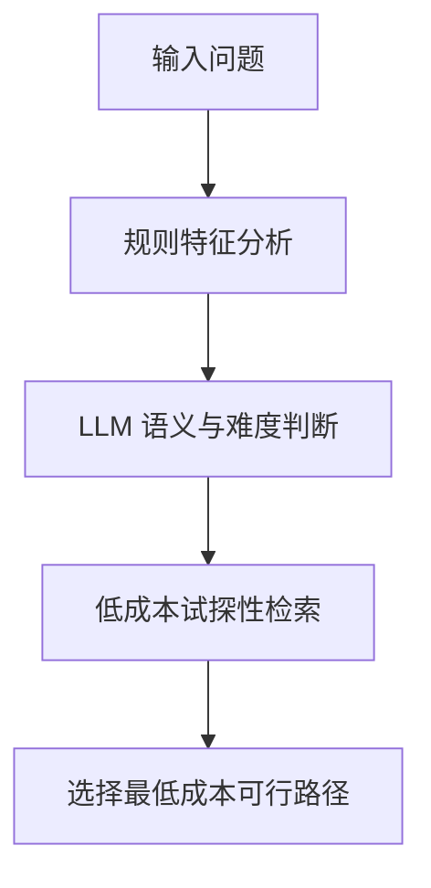

# 面向超图自适应 RAG 的无训练 Router 方案

## 一、研究背景

本研究面向“超图 RAG + 自适应 RAG”的组合场景，首先在医学数据集上进行实验，验证有效后再扩展到通用领域。

Router 的核心任务不是直接回答问题，而是根据问题特征、模型能力和知识库状态，为每个问题选择合适的回答路径。

可以把候选路径抽象为：

| 路径 | 含义 |
|---|---|
| \(R_0\) | 不检索，直接由语言模型回答 |
| \(R_1\) | 普通单次检索，例如向量检索或关键词检索 |
| \(R_2\) | 单次超图检索，利用实体和高阶关系获得证据 |
| \(R_3\) | 多步超图检索与迭代推理 |
| \(R_U\) | 当前系统无法可靠回答，需要拒答、人工处理或外部知识补充 |

Router 的目标可以形式化为：

$$
R^*(q)=
\arg\min_{R_i} C(R_i)
$$

满足：

$$
P(\text{稳定正确}\mid q,R_i)\geq \tau
$$

其中：

- \(q\) 表示问题；
- \(C(R_i)\) 表示路径成本；
- \(\tau\) 表示系统要求的可靠性下限；
- \(R^*(q)\) 表示能够稳定正确回答该问题的最低成本路径。

Adaptive-RAG 的核心思想也是在无检索、单步检索和多步检索之间动态选择，使简单问题避免不必要的计算，使复杂问题获得更充分的外部知识。不过，原始 Adaptive-RAG 使用了经过训练的小型分类器。[Adaptive-RAG](https://aclanthology.org/2024.naacl-long.389/)

本研究的限制条件是不专门训练 Router，因此需要从规则、现有大模型和检索系统自身的运行信号中构造路由决策。

以下给出三个可以独立实验、也可以逐步组合的无训练 Router 方案。

# 二、方案一：基于显式难度特征和规则评分的 Router

## 2.1 方案背景

最直接的无训练方法，是将问题难度拆成一组可解释特征，然后根据这些特征判断问题需要哪一级回答路径。

这种方法不依赖新的分类模型，而是将领域知识、问题结构和超图结构先验写成显式决策规则。

它所估计的不是抽象的语言复杂度，而是问题对不同系统能力的需求，例如：

- 是否需要外部知识；
- 是否需要检索多个事实；
- 是否涉及多个实体之间的关系；
- 是否需要高阶关系；
- 是否存在时间、条件、比较或因果约束；
- 普通检索是否可能不足；
- 是否需要多步超图推理。

## 2.2 执行动机

在医学场景中，问题难度通常具有较强的结构规律。例如：

- “高血压的定义是什么”主要是单事实知识问题；
- “某药物有哪些禁忌证”可能需要单次检索；
- “某患者同时具有疾病 A、合并症 B 并正在使用药物 C，是否适合治疗 D”通常涉及多个实体和条件之间的高阶关系；
- “根据症状、检查结果和既往治疗过程判断下一步治疗方案”可能需要多条超边和多阶段推理。

这些结构信号不一定需要通过训练才能识别。通过显式特征描述，可以先建立一个可解释的 Router 基线。

该方案尤其适合作为实验中的第一个 Router，因为其行为容易分析，也容易判断系统失败究竟来自规则设计、检索系统还是生成模型。

## 2.3 理论依据

该方案主要建立在三个理论基础上。

### 2.3.1 多维问题难度

问题难度不是单一属性，可以拆分为：

$$
\mathbf D(q)=
\left(
D_{\text{reason}},
D_{\text{retrieval}},
D_{\text{hyper}},
D_{\text{model}}
\right)
$$

其中：

- \(D_{\text{reason}}\)：推理难度；
- \(D_{\text{retrieval}}\)：检索难度；
- \(D_{\text{hyper}}\)：超图结构难度；
- \(D_{\text{model}}\)：问题相对于当前模型的认知难度。

GRADE 将 RAG 问题难度拆分为推理深度和查询—证据语义距离两个维度，说明多维难度比单一的“简单、困难”标签更有诊断价值。[GRADE](https://aclanthology.org/2025.findings-emnlp.236/)

### 2.3.2 问题复杂度与所需路径存在关系

Adaptive-RAG 表明，不同问题适合不同复杂度的路径：简单问题可以直接回答，中等问题适合单步检索，复杂问题需要迭代检索和多步推理。[Adaptive-RAG](https://aclanthology.org/2024.naacl-long.389/)

虽然原方法训练了分类器，但“问题复杂度决定最低所需路径”的思想可以转化为显式规则。

### 2.3.3 超图拓扑反映高阶关系需求

普通图以二元边描述实体关系，而超图的一条超边可以同时连接多个实体，适合表示药物、疾病、患者条件、剂量和治疗结果共同构成的医学事实。

HyperGraphRAG 表明，高阶关系表示能够保存复杂的多实体事实，并支持跨实体和超边的检索与推理。[HyperGraphRAG](https://proceedings.neurips.cc/paper_files/paper/2025/file/df55ee6e59f8ac4a625219e11fe9ddba-Paper-Conference.pdf)

因此，问题涉及的实体数量、条件数量和关系组合方式，可以作为是否需要超图路径的先验信号。

## 2.4 核心思想

该方案首先得到问题的多维难度画像：

$$
\mathbf D(q)=
\left(
D_{\text{reason}},
D_{\text{retrieval}},
D_{\text{hyper}},
D_{\text{model}}
\right)
$$

然后将其映射到不同路径：

$$
f_{\text{rule}}(\mathbf D(q))
\rightarrow
\{R_0,R_1,R_2,R_3,R_U\}
$$

其中，规则可以表达为以下抽象逻辑：

- 模型认知难度低、外部知识依赖低，倾向于 \(R_0\)；
- 外部知识依赖较高，但证据集中且推理简单，倾向于 \(R_1\)；
- 问题依赖多实体高阶关系，但必要关系集中在少量超边内，倾向于 \(R_2\)；
- 问题需要多个超边、多个中间实体或顺序推理，倾向于 \(R_3\)；
- 知识库缺少必要证据，或者问题本身不可判定，倾向于 \(R_U\)。

这种映射不是在判断问题“看起来难不难”，而是在判断不同能力是否为回答问题所必需。

## 2.5 为什么这样做

规则评分 Router 具有以下优点：

- 不需要训练数据；
- 不需要标注大量路由标签；
- 每个决策都可以解释；
- 适合医学领域的安全审查；
- 可以明确观察不同难度维度对路由结果的影响；
- 可以作为后续复杂 Router 的基准；
- 可以用于发现问题集设计中的难度分布偏差。

它的主要价值不是追求最高性能，而是建立一个稳定、透明、可诊断的实验起点。

## 2.6 预期结果

该方案预期形成一个可解释的 Router：

- 能够识别明显不需要检索的问题；
- 能够将单事实外部知识问题交给普通检索；
- 能够将高阶多实体问题交给超图检索；
- 能够将明显的多步关系问题交给多步超图路径；
- 能够解释每次路由所依据的难度因素；
- 能够为后续方案提供基准结果和错误案例。

# 三、方案二：基于 LLM-as-a-Judge 的零样本 Router

## 3.1 方案背景

第二种方案是不训练新的分类器，而是直接使用现有大语言模型作为问题复杂度评估器。

Router 向现有 LLM 描述：

- 当前系统有哪些候选路径；
- 每条路径适合处理什么类型的问题；
- 各路径具有什么成本和能力；
- 问题难度应从哪些维度分析；
- 输出必须遵循什么结构。

LLM 根据这些说明，对问题进行零样本或少样本分析，然后输出推荐路径。

这种方法本质上是：

$$
f_{\text{LLM}}(q,\mathcal S,\Pi)
\rightarrow
R_i
$$

其中：

- \(q\) 是问题；
- \(\mathcal S\) 是当前系统能力；
- \(\Pi\) 是候选路径集合；
- \(R_i\) 是 LLM 推荐的路径。

## 3.2 执行动机

固定规则擅长识别明确的表面结构，但医学问题中经常存在隐含关系。

例如，一个问题表面上只出现两个实体，但回答时可能需要模型识别：

- 隐含疾病阶段；
- 潜在禁忌证；
- 患者条件对治疗选择的影响；
- 不同检查指标之间的因果关系；
- 一个医学概念是否需要最新证据；
- 一个问题是事实查询还是临床推断。

LLM 对自然语言语义、任务意图和隐含推理需求的理解通常强于简单规则，因此可以作为无需训练的语义 Router。

## 3.3 理论依据

### 3.3.1 In-context Learning

大语言模型能够根据任务说明和少量示例，在不更新参数的情况下完成新的分类任务。

因此，可以把路由看作一个结构化分类任务：让模型根据给定定义，把问题分配到无检索、普通检索、超图检索或多步超图推理。

### 3.3.2 LLM 的元认知判断

模型可以对以下内容进行显式判断：

- 自己是否掌握相关知识；
- 问题是否依赖最新事实；
- 是否存在多个必要实体；
- 是否需要组合多个证据；
- 是否涉及高阶条件关系；
- 是否存在较高的错误风险。

这类判断不一定完全可靠，但可以作为模型认知难度和推理难度的代理信号。

### 3.3.3 复杂度驱动的路径选择

Adaptive-RAG 将问题分配到无检索、单步检索和多步检索路径，证明将路由建模为问题复杂度分类具有实际价值。[Adaptive-RAG](https://aclanthology.org/2024.naacl-long.389/)

本方案保留该任务定义，但使用现有 LLM 的零样本判断代替专门训练的分类器。

## 3.4 核心思想

LLM Router 不应只输出“简单、中等、困难”，而应先形成结构化的难度判断：

```json
{
  "external_knowledge_need": "low | medium | high",
  "reasoning_difficulty": "low | medium | high",
  "retrieval_difficulty": "low | medium | high",
  "hypergraph_difficulty": "low | medium | high",
  "model_knowledge_risk": "low | medium | high",
  "answerability_risk": "low | medium | high",
  "recommended_route": "R0 | R1 | R2 | R3 | RU",
  "reason": "路由依据"
}
```

这种设计将“分析”和“最终路径”绑定在一起，使 Router 的输出具有可解释性。

LLM 的目标不是预测一个抽象难度等级，而是回答：

> 在当前模型、知识库和候选路径条件下，哪条路径最可能以最低成本稳定回答这个问题？

## 3.5 为什么这样做

LLM 零样本 Router 具有以下优势：

- 不需要额外训练；
- 能理解医学术语和隐含关系；
- 能分析开放式问题；
- 能同时考虑多个难度维度；
- 修改路径定义后只需要修改任务说明；
- 从医学扩展到其他领域时具有较强迁移能力；
- 可以输出自然语言理由，便于错误分析。

与固定规则相比，它更加灵活；与训练分类器相比，它不需要提前构建大量标注数据。

## 3.6 主要风险

LLM Router 的判断可能存在以下问题：

- 模型可能高估自己的知识；
- 模型表达的置信度不一定经过校准；
- 相同问题在多次判断中可能得到不同路径；
- 模型可能根据问题长度而不是真实知识需求判断难度；
- 对专业医学问题可能表现出“看似合理但判断错误”的现象；
- Router 自身也会产生额外推理成本。

因此，LLM 的自我判断不应自动被视为真实难度标签，而应被看作一种需要通过实际路径表现验证的代理信号。

## 3.7 预期结果

该方案预期得到一个语义理解能力较强的无训练 Router：

- 能识别规则难以发现的隐含医学关系；
- 能区分知识查询、关系查询和临床推理；
- 能识别需要超图结构的问题；
- 能为路由结果提供结构化解释；
- 能较容易迁移到其他领域；
- 能作为规则 Router 的性能上界或互补方案。

# 四、方案三：基于试探性检索和检索分布信号的 Router

## 4.1 方案背景

前两个方案主要根据问题本身进行路由，但问题文本只能提供间接信号。

一个问题是否难以检索、是否需要超图、知识库是否覆盖必要证据，通常只有在接触知识库后才能更准确地判断。

因此，第三种方案不直接执行完整 RAG，而是先进行一次低成本的试探性检索，根据检索结果的分数分布、实体覆盖和关系结构判断后续路径。

该方案可以表示为：

$$
z(q)=\operatorname{ProbeRetrieve}(q)
$$

$$
f_{\text{probe}}(q,z(q))
\rightarrow
\{R_0,R_1,R_2,R_3,R_U\}
$$

其中 \(z(q)\) 表示试探性检索产生的运行时信号。

## 4.2 执行动机

仅根据问题文本，很难判断以下情况：

- 知识库中是否真的存在相关知识；
- 普通向量检索能否直接找到答案；
- 检索结果是否集中在少量高相关证据上；
- 是否存在大量相似但互相冲突的候选证据；
- 问题中的实体是否能映射到超图节点；
- 一个超边是否已经覆盖全部必要实体；
- 是否需要沿多个超边继续扩展；
- 问题不可回答究竟是推理难，还是知识库缺失。

试探性检索相当于在正式选择路径前，让 Router 低成本地观察知识库对该问题的响应。

## 4.3 理论依据

### 4.3.1 检索分数分布可以反映问题难度

SkewRoute 发现，检索器产生的相关性分数分布与问题难度之间存在明显关系，并利用检索分数分布的偏度构造无需训练的 KG-RAG Router。[SkewRoute](https://aclanthology.org/2025.findings-emnlp.606/)

其基本直觉是：

- 如果少数候选证据的分数明显高于其他证据，说明检索器找到了较明确的相关证据；
- 如果大量候选证据分数接近，说明检索存在歧义；
- 如果所有证据分数都较低，可能意味着语义距离较远、查询表达不匹配或知识库覆盖不足。

因此，不能只观察 Top-1 分数，还应关注整个候选结果的分布形态。

### 4.3.2 信息需求应根据运行时状态判断

DRAGIN 根据模型生成过程中的不确定性、token 影响力和语义重要性判断什么时候需要检索，说明检索需求可以由运行时信息动态决定，而不是完全依赖静态问题分类。[DRAGIN](https://aclanthology.org/2024.acl-long.702/)

虽然本研究关注问题级 Router，但可以继承这一思想：系统应根据实际暴露的信息需求决定是否升级检索路径。

### 4.3.3 超图结构本身提供路由信号

在超图场景中，试探性检索不仅返回文本，还可以返回：

- 匹配实体；
- 候选超边；
- 实体与超边之间的覆盖关系；
- 是否存在连通的证据子超图；
- 候选结构是否存在大量分支；
- 必要实体是否集中在一个超边中；
- 是否需要进一步沿超边扩展。

这些结构信号比单纯分析问题文本更直接地反映超图检索的必要性。

## 4.4 核心思想

试探性检索 Router 关注三类信号。

### 4.4.1 检索相关性信号

用于判断当前知识库是否提供了明显相关的证据，例如：

- 最高相关性；
- Top-K 平均相关性；
- 最高分与后续候选之间的差距；
- 分数分布的偏度、方差或熵；
- 高相关候选的数量；
- 不同检索器结果的一致程度。

### 4.4.2 证据覆盖信号

用于判断普通检索结果是否足以支持答案，例如：

- 问题中的关键实体是否被覆盖；
- 关键关系是否被覆盖；
- 是否只找到了部分必要证据；
- 多条证据是否共同支持同一个结论；
- 是否存在相互矛盾的证据；
- 证据是否具有明确来源。

### 4.4.3 超图结构信号

用于判断是否需要升级到超图或多步超图路径，例如：

- 候选实体是否位于同一条超边；
- 是否需要多个超边才能连接关键实体；
- 是否存在必须经过的中间实体；
- 候选子超图是否具有明显分支；
- 是否存在多个结构相似的候选子图；
- 当前检索是否形成了充分且连通的证据结构。

## 4.5 路由逻辑

该方案的抽象决策逻辑为：

- 如果模型可直接回答，且问题不具有明显外部知识需求，可以选择 \(R_0\)；
- 如果试探性普通检索返回少量高相关且证据充分的结果，可以选择 \(R_1\)；
- 如果普通检索证据分散，但超图中存在覆盖关键实体的高阶超边，可以选择 \(R_2\)；
- 如果关键实体需要通过多个超边连接，或者证据存在顺序依赖，可以选择 \(R_3\)；
- 如果所有检索分数都很低、关键实体无法映射或必要关系不存在，应考虑 \(R_U\)，而不是盲目增加检索深度。

## 4.6 为什么这样做

试探性检索 Router 的核心优势是：它不只是预测问题难度，而是观察问题与当前知识库之间的真实交互。

它具有以下价值：

- 不需要训练专门的分类模型；
- 能够适应知识库内容变化；
- 能够发现知识覆盖不足；
- 能够利用超图结构信号；
- 能将检索困难与推理困难分开；
- 能减少仅凭 LLM 自我判断造成的过度自信；
- 更适合判断普通检索和超图检索之间的边界；
- 更容易从医学知识库迁移到其他领域知识库。

## 4.7 预期结果

该方案预期能够：

- 根据知识库的实际反馈判断问题难度；
- 区分“普通检索已经足够”和“必须使用超图关系”；
- 识别需要多步超图扩展的问题；
- 识别知识库缺失而不是持续升级检索；
- 在无需训练的条件下实现与知识库状态联动的动态路由；
- 为后续组合 Router 提供最重要的运行时证据。

# 五、三个方案的关系

三个方案分别从不同角度估计问题所需路径：

| 方案 | 主要依据 | 优点 | 主要局限 |
|---|---|---|---|
| 方案一：规则评分 | 显式问题特征和超图先验 | 可解释、稳定、成本低 | 难以识别隐含语义 |
| 方案二：LLM Router | LLM 对问题和系统能力的语义判断 | 灵活、迁移性强 | 自我判断可能失准 |
| 方案三：试探性检索 | 检索分布、证据覆盖和超图结构 | 与真实知识库状态相关 | 需要支付一次轻量检索成本 |

三者不是互斥关系，而是三种不同的信息来源：

$$
\text{静态显式特征}
+
\text{LLM语义判断}
+
\text{知识库运行时信号}
$$

可以将三者理解为一个逐步增加信息的过程：



在实验研究中，可以分别评价三个方案，也可以将其组合成级联式 Router：

1. 规则能够明确判断的问题直接路由；
2. 规则无法明确判断的问题交给 LLM；
3. LLM 判断仍不稳定的问题执行试探性检索；
4. 根据检索分布和超图结构作出最终决定。

这种组合仍然不需要训练新的分类模型，同时能够在成本、可解释性和准确性之间取得平衡。

# 六、预期研究结论

通过三个方案的对比，研究最终应回答以下问题：

1. 仅使用问题表面和结构特征，能在多大程度上判断路径需求？
2. LLM 的零样本难度判断是否优于人工规则？
3. LLM 是否会系统性高估或低估自己的知识能力？
4. 检索分数分布能否有效反映医学问题的检索难度？
5. 超图结构信号是否能够区分普通 RAG 和超图 RAG 的适用边界？
6. 组合 Router 是否能够接近“最低稳定成功路径”标签？
7. Router 是否减少了不必要的检索和多步推理？
8. 在医学数据集上得到的路由规律能否迁移到其他领域？

三个方案最终共同服务于同一个目标：

> 在不训练专用 Router 模型的条件下，利用可解释规则、现有大模型和知识库运行时信号，为每个问题选择能够稳定正确回答的最低成本路径。